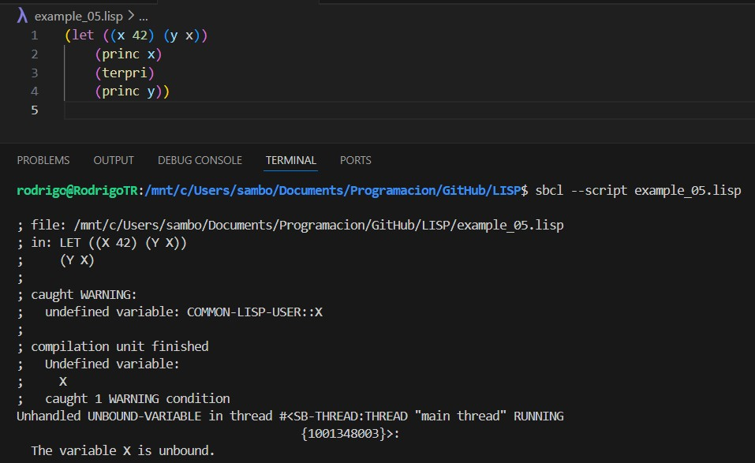
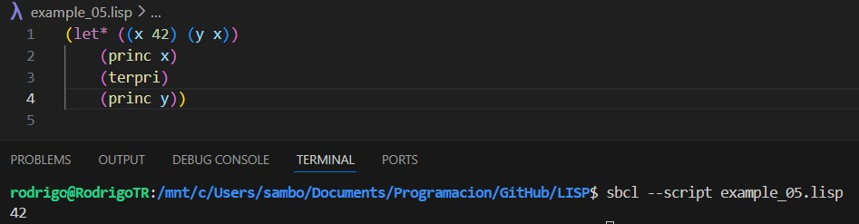

# Variables y ramificaciones
Para definir una función el LISP, se utiliza la siguiente sinxasis:
```
(defun funcion-nombre (parametros) 
"caden de documentación opcional"
expresiones-del-cuerpo-de-la-funcion Parametro-Final-Retorno)
````

Ejemplo:
```
(defun sumar-dos (num1 num2)
    "Suma dos numeros y regresa la suma"
    (+ num1 num2))
```
note como (+ num1 num2) es el "valor de retorno" de la función <br>
Reutilización de variables, observe que intentamos usar una varible dentro de la definición 

Recibimos un mensaje de error, porque la funcion LET se ejecuta en paralelo, para evitar este error, utilice el simbolo *
despues del nombre de la función:


## Lista de archivos de código de ejemplo:

[example_02.lisp](.\example_02.lisp)
<br>
[example_03.lisp](.\example_03.lisp)
<br>
[example_04.lisp](.\example_04.lisp)
<br>
[example_05.lisp](.\example_05.lisp)
<br>
[example_06.lisp](.\example_06.lisp)
