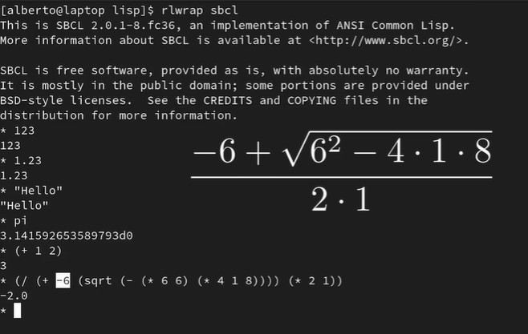
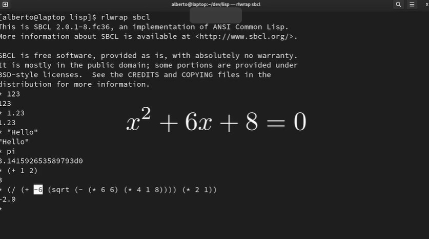

# Sintaxis de LISP
El interprete de LISP pasa por estos pasos antes de ejecutar una instrucción:
    
    1. Lee el texto de entrada
    2. Interpreta la entrada como un objeto de LISP
    3. Evalua el objeto
    4. Elige una representación
    5. Imprime el resultado en la pantalla

Esto se conoce como READ EVAL PRINT LOOP (REPL), ahora ingrese al interprete de LISP:
```
#En la terminal WSL teclee:
sbcl
* 123
123
* 1.23
1.23
* "hello"
"hello"
* pi
3.141592653589793d0
```
Lo anterior muestra algunos de los objetos de LISP más comúnes, ahora vamos a centrarnos en el tipo
principal de LISP, la lista:

En la lista el operador va primero y los parametros despues, separados por espacios todo agrupado en parentesis
```
* (+ 1 2)
3

```
Usando la ecuación que se muestra en la figura:



Calculamos el resultado en el interprete de LISP
```
* (/  (+ -6 (sqrt (- (* 6 6) (* 4 1 8)))) (* 2 1))
-2.0
* 
```
y lo utilizamos en la ecuacion



Y usamo el valor calculado con antelación para resolver la ecuación:
```
* (+ (* -2 -2) (* 6 -2) 8)
0
* 
```
Ahora si deseamos simplemente referirnos a los simbolos y no queremos que se evalue la linea, utilizamos el 
caracter ' como se muestra a continuación:
```
* (+ 1 2)
3
* '(+ 1 2)
(+ 1 2)
* pi
3.141592653589793d0
* 'pi
PI
*
```

## Lista de archivos de código de ejemplo:
 [example_02.lisp](./examples/example_02.lisp)