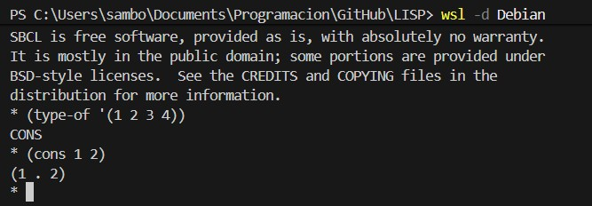
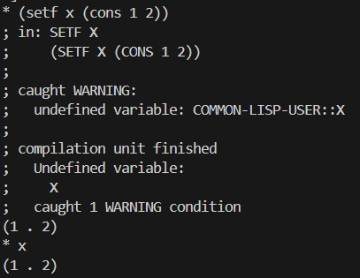
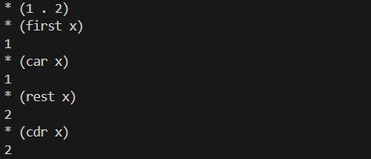
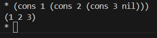
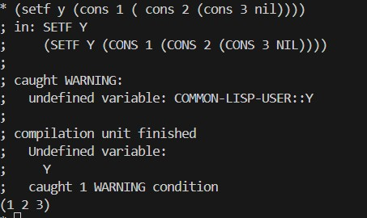
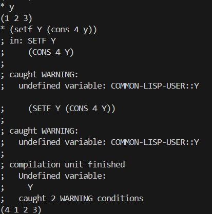
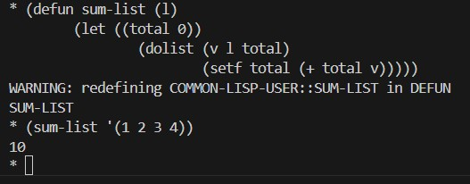

# Listas
Las listas son el la estuctura fundamental de datos ne LISP, pueden contener cero o más elemementos incluyendo otras listas, en la figura se muestra como verifical el tipo de dato de una lista:



Vamos a cargar la variable X con una lista de dos valores 1 y 2



Veremos un error debido a que LISP funciona en paralelo, pero al final de la evalución termina agregando la lista
Realizamos algunas operaciones con la lista:



Mostramos el primer elemento de la lista, con "first" y el resto de los elementos con "rest"
Definiendo una lista dentro de otra lista:


Una lista que contiene datos y referencias a otra lista se llama en conmputación lista enlazada,
en efecto el ejemplo anterior muestra esto, ahora asignamos la lista anterior a un variable denotada
por Y:



Podemos asignar nuevos elementos a la lista dentro de la variable Y:



Al finalizar la instrucción observamos que existe un nuevo elemento al principio de la lista, agregar un elemento
al final de una lista consume varios recursos computacionales.
Para definir una lista vacia utilizamos el simbolo ':
```
*'()
NIL
```
Otras opereciones comúnes en listas son: número de elementos en la lista, revertir la lista, anexar un elemento o lista, estas operaciónes no cambian el contenido de la lista en la variable Y:
```
* (length y)
4
* (reverse y)
(3 2 1 4)
* (append y '(5 6 7 ))
(4 1 2 3 5 6 7)
* y
(4 1 2 3)
```
Algunas de estas operaciones toman muchos recursos computacionales, por ejempo para saber el numero de elemnentos en una lista
debemos recorrer toda la lista.
Tambien podemos definir funciones que trabajan sobre las listas:



El código anterior lo puede tomar del archivo example_017.lisp
## Programas de ejemplo:

[example_17.lisp](.\example_17.lisp)