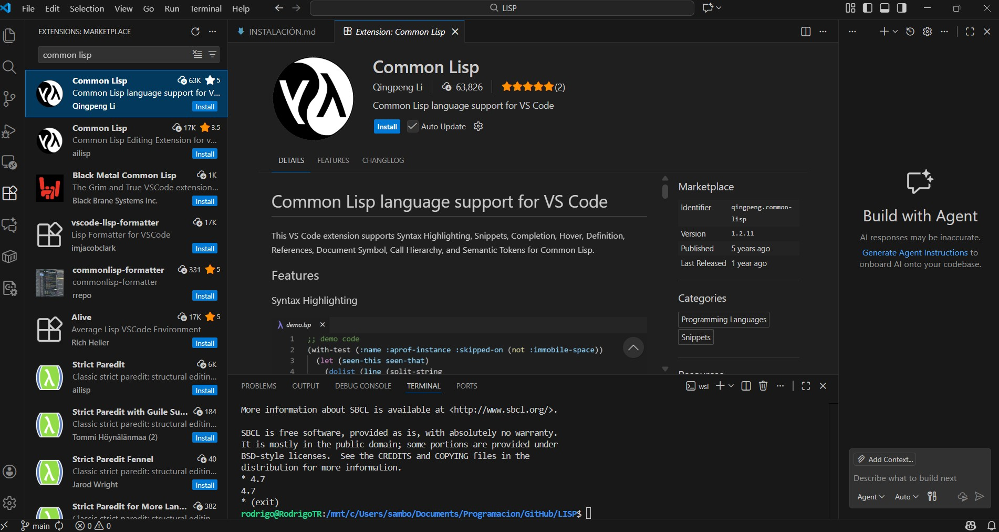

Para instalar LISP en WSL Debian utilice los siguientes comandos:

```
sudo apt update
sudo apt install sbcl
```
Opcionalmente instale QuickLisp un administrador de librerias, que facilita la localización adicionales para LISP, descargue el paquete:

```
sudo apt install curl
curl -o /tmp/ql.lisp http://beta.quicklisp.org/quicklisp.lisp

```

Instale el paquete:
```
sbcl --no-sysinit --no-userinit --load /tmp/ql.lisp \
         --eval '(quicklisp-quickstart:install :path "~/.quicklisp")' \
         --eval '(ql:add-to-init-file)' \
         --quit

```
Verifique la instalación:
```
sbcl #Para ingresar a la aplicación y pruebe ejecutar
(ql:quickload "cl-ppcre") #para verificar que esta instalado el paquete de busqueda de librerias
```
Para salir del editor de LISP use alguno de los siguientes comandos:
```
(exit)
(quit)
```

Instale una extensión para el editor de VS Code, esto ayuda a visualizar mejor el código



Ejemplo de un primer programa en LISP y su ejecución:


